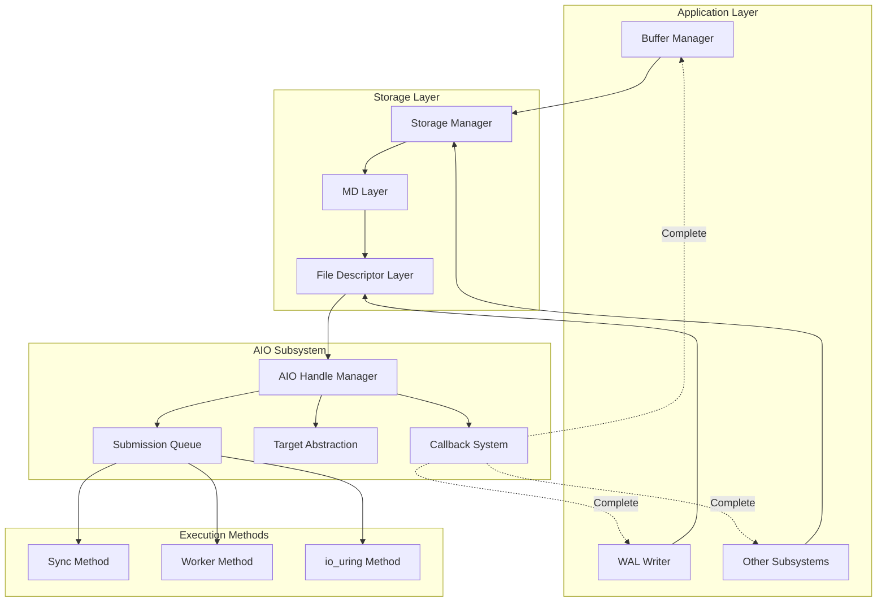
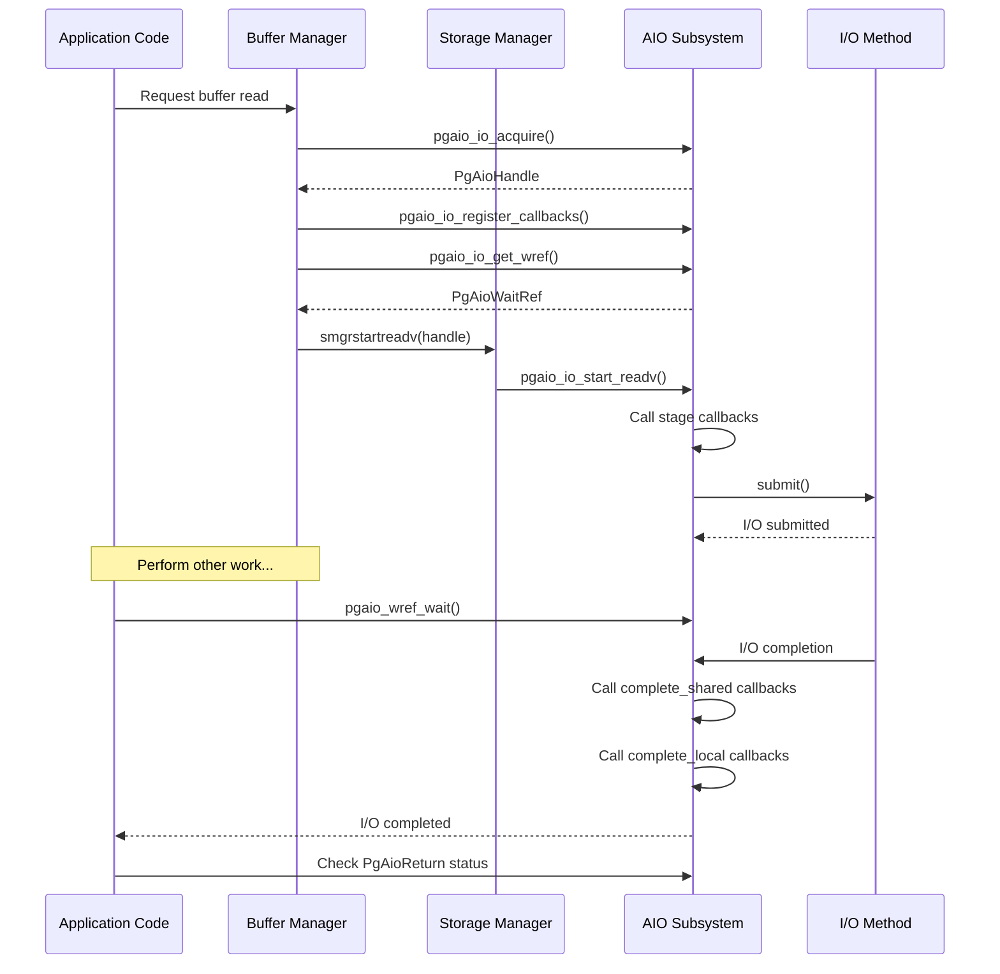
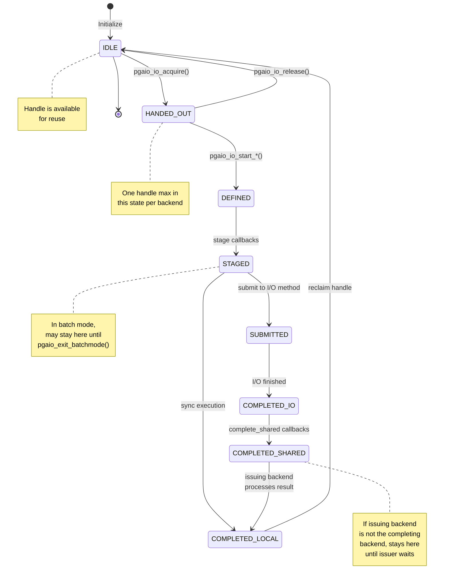
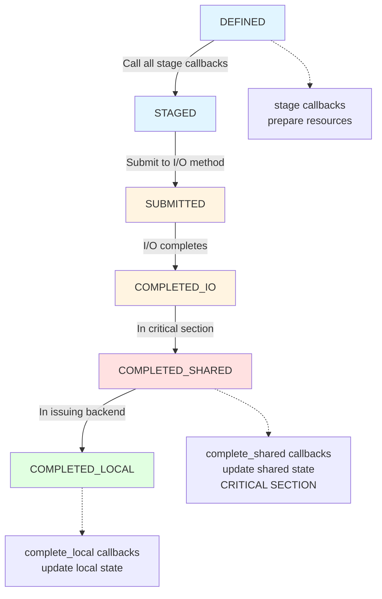
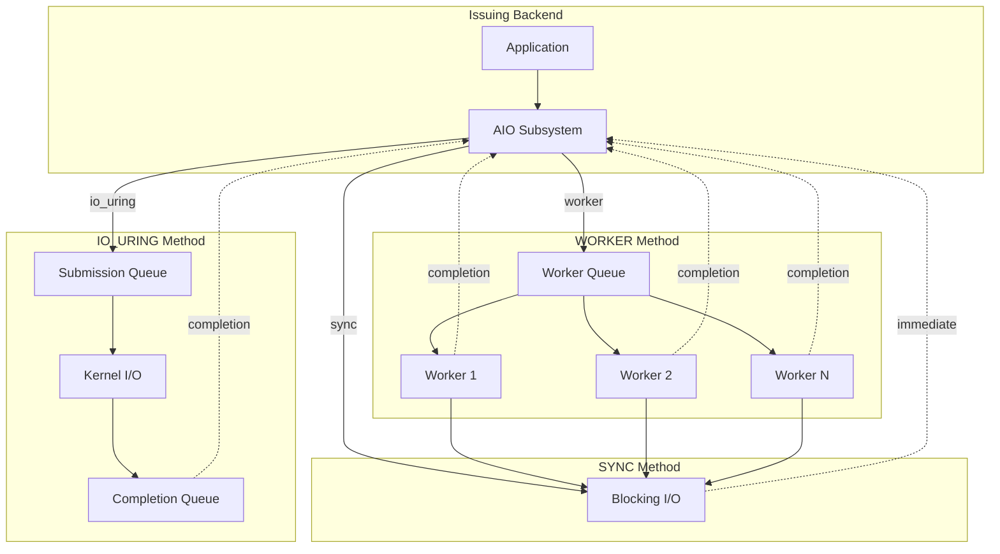
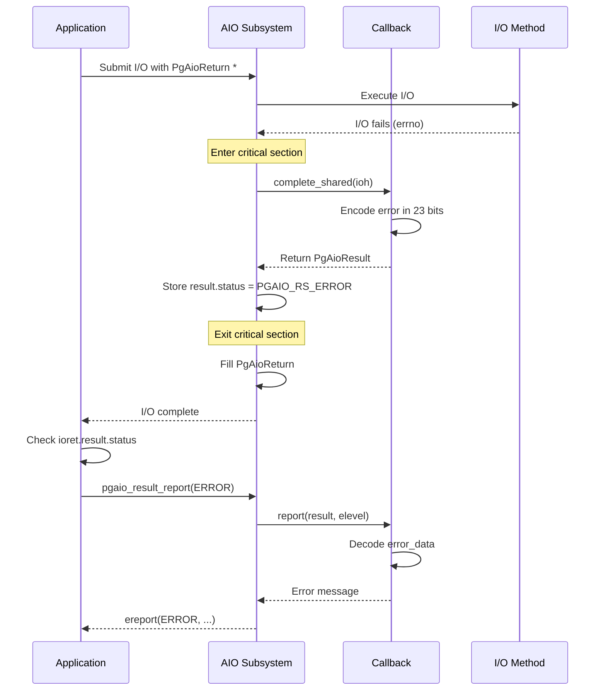

# PostgreSQL Asynchronous I/O (AIO) Interface Documentation

## Table of Contents

1. [Overview](#overview)
2. [Architecture](#architecture)
3. [Core Components](#core-components)
4. [Public Interfaces](#public-interfaces)
5. [Usage Patterns](#usage-patterns)
6. [State Machine](#state-machine)
7. [Implementation Methods](#implementation-methods)
8. [Key Design Decisions](#key-design-decisions)

---

## Overview

The PostgreSQL AIO (Asynchronous I/O) subsystem provides a unified interface for performing asynchronous I/O operations across different platforms and execution methods. This interface enables PostgreSQL to:

- Perform non-blocking I/O operations
- Improve throughput through concurrent I/O execution
- Support direct I/O to avoid double buffering
- Enable efficient prefetching and controlled writeback
- Reduce WAL write latency through asynchronous operations

### Key Features

- **Platform Independence**: Abstracts different I/O methods (synchronous, worker-based, io_uring)
- **Shared Memory Architecture**: Supports multi-process model with cross-backend I/O completion
- **Callback System**: Layered completion callbacks for modular I/O handling
- **Critical Section Safety**: Can execute I/O operations within critical sections
- **Resource Management**: Integrated with PostgreSQL's resource owner mechanism

### File Organization

The AIO subsystem is organized across multiple files:

| File | Purpose |
|------|---------|
| `aio.h` | Main public interface for issuing AIO |
| `aio_types.h` | Type definitions (lightweight include) |
| `aio_subsys.h` | Subsystem initialization interface |
| `aio_internal.h` | Internal declarations for AIO subsystem |
| `aio.c` | Core logic and handle management |
| `aio_init.c` | Server and backend initialization |
| `aio_io.c` | Method-independent I/O operation code |
| `aio_callback.c` | Callback lifecycle management |
| `aio_target.c` | I/O target abstraction |
| `method_*.c` | Different I/O execution methods |
| `README.md` | High-level design overview |

---

## Architecture

### System Architecture Diagram



### Component Interaction Flow



---

## Core Components

### 1. AIO Handles (`PgAioHandle`)

AIO Handles are the central abstraction for I/O operations. Each handle represents a single I/O operation and contains:

**Location**: `src/include/storage/aio_internal.h:102`

```c
struct PgAioHandle {
    uint8 state;              // Current state (PgAioHandleState)
    uint8 target;             // Target type (PgAioTargetID)
    uint8 op;                 // I/O operation (PgAioOp)
    uint8 flags;              // Flags (PgAioHandleFlags)
    uint8 num_callbacks;      // Number of registered callbacks
    uint8 callbacks[PGAIO_HANDLE_MAX_CALLBACKS];
    uint8 callbacks_data[PGAIO_HANDLE_MAX_CALLBACKS];
    uint8 handle_data_len;    // Length of associated data
    int32 owner_procno;       // Owning backend
    int32 result;             // Raw I/O result
    uint64 generation;        // Reuse counter
    PgAioResult distilled_result;
    PgAioOpData op_data;      // Operation-specific data
    PgAioTargetData target_data;  // Target identification
    // ... other fields
};
```

**Key Properties**:
- Allocated in shared memory
- Reusable after completion
- Limited quantity per backend (controlled by `io_max_concurrency`)
- Only one can be "handed out" but not yet defined per backend

### 2. AIO Operations (`PgAioOp`)

**Location**: `src/include/storage/aio.h:87`

Currently supported operations:

```c
typedef enum PgAioOp {
    PGAIO_OP_INVALID = 0,
    PGAIO_OP_READV,   // Vectored read
    PGAIO_OP_WRITEV,  // Vectored write
} PgAioOp;
```

**Future Operations** (planned):
- `fsync` / `fdatasync`
- `flush_range`
- Network operations: `send`, `recv`, `accept`

### 3. AIO Targets (`PgAioTargetID`)

**Location**: `src/include/storage/aio.h:116`

Targets identify what type of object I/O is performed on:

```c
typedef enum PgAioTargetID {
    PGAIO_TID_INVALID = 0,
    PGAIO_TID_SMGR,  // Storage manager (relation files)
} PgAioTargetID;
```

Each target provides:
- **Reopen capability**: For worker processes to reopen files
- **Description**: For logging and error messages
- **Target-specific data**: Stored in `PgAioTargetData`

**SMGR Target Data** (`src/include/storage/aio_types.h:61`):
```c
typedef union PgAioTargetData {
    struct {
        RelFileLocator rlocator;  // Physical relation identifier
        BlockNumber blockNum;      // Block number
        BlockNumber nblocks;       // Number of blocks
        ForkNumber forkNum:8;      // Fork type
        bool is_temp:1;            // Temporary relation flag
        bool skip_fsync:1;         // Skip fsync flag
    } smgr;
} PgAioTargetData;
```

### 4. Wait References (`PgAioWaitRef`)

**Location**: `src/include/storage/aio_types.h:32`

Wait references enable waiting for I/O completion without holding the handle:

```c
typedef struct PgAioWaitRef {
    uint32 aio_index;         // Index to PgAioHandle
    uint32 generation_upper;  // Generation counter (upper)
    uint32 generation_lower;  // Generation counter (lower)
} PgAioWaitRef;
```

**Properties**:
- Can be stored in local or shared memory
- Can be passed across process boundaries
- Multiple references can exist for one I/O
- Safe even if handle is reused (generation check)

### 5. Result Status (`PgAioResult`)

**Location**: `src/include/storage/aio_types.h:99`

Encodes I/O operation results compactly:

```c
typedef struct PgAioResult {
    uint32 id:6;          // PgAioHandleCallbackID
    uint32 status:3;      // PgAioResultStatus
    uint32 error_data:23; // Callback-defined error data
    int32 result;         // Raw operation result
} PgAioResult;
```

**Result Status Values**:
```c
typedef enum PgAioResultStatus {
    PGAIO_RS_UNKNOWN,   // Not yet completed
    PGAIO_RS_OK,        // Succeeded completely
    PGAIO_RS_PARTIAL,   // Partial success, no error
    PGAIO_RS_WARNING,   // Succeeded with warning
    PGAIO_RS_ERROR,     // Failed
} PgAioResultStatus;
```

### 6. Callbacks (`PgAioHandleCallbacks`)

**Location**: `src/include/storage/aio.h:213`

```c
struct PgAioHandleCallbacks {
    PgAioHandleCallbackStage stage;
    PgAioHandleCallbackComplete complete_shared;
    PgAioHandleCallbackComplete complete_local;
    PgAioHandleCallbackReport report;
};
```

**Callback Lifecycle**:


**Callback Types**:

1. **`stage`**: Prepare resources before I/O submission
   - Example: Increase buffer pin count
   - Called before I/O is submitted

2. **`complete_shared`**: Update shared state upon completion
   - Executed in critical section
   - Can be called by any backend
   - Called in LIFO order (last registered, first called)

3. **`complete_local`**: Update local state in issuing backend
   - Called only in issuing backend
   - After all `complete_shared` callbacks

4. **`report`**: Generate error/log messages
   - Not in critical section
   - Can raise errors

**Predefined Callbacks** (`src/include/storage/aio.h:192`):
```c
typedef enum PgAioHandleCallbackID {
    PGAIO_HCB_INVALID = 0,
    PGAIO_HCB_MD_READV,              // MD layer read
    PGAIO_HCB_SHARED_BUFFER_READV,   // Shared buffer read
    PGAIO_HCB_LOCAL_BUFFER_READV,    // Local buffer read
} PgAioHandleCallbackID;
```

---

## Public Interfaces

### Handle Management

#### Acquire Handle

```c
PgAioHandle *pgaio_io_acquire(struct ResourceOwnerData *resowner,
                               PgAioReturn *ret);
```
**Location**: `src/include/storage/aio.h:278`

- Acquires an AIO handle, waiting if necessary
- Returns handle from idle pool or waits for oldest I/O
- `resowner`: Resource owner for cleanup on error
- `ret`: Optional pointer to receive result upon completion

```c
PgAioHandle *pgaio_io_acquire_nb(struct ResourceOwnerData *resowner,
                                  PgAioReturn *ret);
```
**Location**: `src/include/storage/aio.h:279`

- Non-blocking version
- Returns NULL if no handle available

#### Release Handle

```c
void pgaio_io_release(PgAioHandle *ioh);
```
**Location**: `src/include/storage/aio.h:281`

- Releases an acquired but not yet defined handle
- Use when handle acquired but I/O not needed

### I/O Operations

#### Start Read/Write

```c
void pgaio_io_start_readv(PgAioHandle *ioh, int fd,
                          int iovcnt, uint64 offset);
void pgaio_io_start_writev(PgAioHandle *ioh, int fd,
                           int iovcnt, uint64 offset);
```
**Location**: `src/include/storage/aio.h:299-302`

- Defines and stages I/O operation on handle
- `fd`: File descriptor
- `iovcnt`: Number of iovec entries
- `offset`: File offset for I/O
- Handle consumed after call (don't reference again)
- I/O may complete immediately

#### Get iovec Array

```c
int pgaio_io_get_iovec(PgAioHandle *ioh, struct iovec **iov);
```
**Location**: `src/include/storage/aio.h:294`

- Returns iovec array for this handle
- Returns number of available iovec entries
- Fill iovec before calling `pgaio_io_start_*`

### Callback Registration

```c
void pgaio_io_register_callbacks(PgAioHandle *ioh,
                                 PgAioHandleCallbackID cb_id,
                                 uint8 cb_data);
```
**Location**: `src/include/storage/aio.h:311`

- Register callback by ID
- `cb_data`: Small data value passed to callback
- Must be called before `pgaio_io_start_*`
- Up to `PGAIO_HANDLE_MAX_CALLBACKS` (4) per handle

### Associated Data

```c
void pgaio_io_set_handle_data_64(PgAioHandle *ioh, uint64 *data, uint8 len);
void pgaio_io_set_handle_data_32(PgAioHandle *ioh, uint32 *data, uint8 len);
uint64 *pgaio_io_get_handle_data(PgAioHandle *ioh, uint8 *len);
```
**Location**: `src/include/storage/aio.h:313-315`

- Associate data with handle (e.g., Buffer IDs)
- Used by completion callbacks
- Maximum length controlled by `io_max_combine_limit`

### Target Management

```c
void pgaio_io_set_target(PgAioHandle *ioh, PgAioTargetID targetid);
bool pgaio_io_has_target(PgAioHandle *ioh);
PgAioTargetData *pgaio_io_get_target_data(PgAioHandle *ioh);
char *pgaio_io_get_target_description(PgAioHandle *ioh);
```
**Location**: `src/include/storage/aio.h:305-308`

- Set and query I/O target information
- Target data filled after `pgaio_io_set_target()`

### Wait References

```c
void pgaio_io_get_wref(PgAioHandle *ioh, PgAioWaitRef *iow);
```
**Location**: `src/include/storage/aio.h:290`

- Get wait reference from handle
- Must be called before `pgaio_io_start_*`

```c
void pgaio_wref_wait(PgAioWaitRef *iow);
bool pgaio_wref_check_done(PgAioWaitRef *iow);
```
**Location**: `src/include/storage/aio.h:328-329`

- Wait for I/O completion
- Check completion without blocking

```c
bool pgaio_wref_valid(PgAioWaitRef *iow);
void pgaio_wref_clear(PgAioWaitRef *iow);
int pgaio_wref_get_id(PgAioWaitRef *iow);
```
**Location**: `src/include/storage/aio.h:324-326`

- Query wait reference state

### Batch Operations

```c
void pgaio_enter_batchmode(void);
void pgaio_exit_batchmode(void);
void pgaio_submit_staged(void);
bool pgaio_have_staged(void);
```
**Location**: `src/include/storage/aio.h:348-351`

**Batch Mode Benefits**:
- Reduce syscall overhead
- Enable kernel-level optimization
- Submit multiple I/Os atomically

**Usage Pattern**:
```c
pgaio_enter_batchmode();
// Issue multiple I/Os
pgaio_io_start_readv(...);
pgaio_io_start_readv(...);
pgaio_io_start_readv(...);
pgaio_exit_batchmode();  // Submits all staged I/Os
```

**Caution**: While in batch mode, other backends may wait for unsubmitted I/O. If this backend then waits for those backends, it creates a deadlock. Only use batch mode when certain not to block on other backends.

### Result Handling

```c
void pgaio_result_report(PgAioResult result,
                        const PgAioTargetData *target_data,
                        int elevel);
```
**Location**: `src/include/storage/aio.h:338`

- Report I/O result (success/warning/error)
- `elevel`: ERROR, WARNING, LOG, etc.
- Generates appropriate error message

### Flags

```c
void pgaio_io_set_flag(PgAioHandle *ioh, PgAioHandleFlags flag);
```
**Location**: `src/include/storage/aio.h:285`

**Available Flags** (`src/include/storage/aio.h:48`):

- **`PGAIO_HF_SYNCHRONOUS`**: Hint that I/O will execute synchronously
  - Optimization hint, not required for correctness

- **`PGAIO_HF_REFERENCES_LOCAL`**: I/O references process-local memory
  - **Required for correctness**
  - Some methods fall back to sync execution

- **`PGAIO_HF_BUFFERED`**: Using buffered I/O
  - Heuristic for some I/O methods

### Subsystem Interface

```c
// Initialization (aio_subsys.h)
Size AioShmemSize(void);
void AioShmemInit(void);
void pgaio_init_backend(void);

// Transaction cleanup
void AtEOXact_Aio(bool is_commit);
void pgaio_error_cleanup(void);
```
**Location**: `src/include/storage/aio_subsys.h:22-31`

### File Descriptor Management

```c
void pgaio_closing_fd(int fd);
```
**Location**: `src/include/storage/aio.h:360`

- Notify AIO subsystem before closing file descriptor
- Ensures all in-flight I/O on fd completes
- Required for some I/O methods

---

## Usage Patterns

### Basic Read Operation

```c
/* Result storage (must outlive I/O or ResourceOwner) */
PgAioReturn ioret;

/* Acquire handle */
PgAioHandle *ioh = pgaio_io_acquire(CurrentResourceOwner, &ioret);

/* Get wait reference */
PgAioWaitRef iow;
pgaio_io_get_wref(ioh, &iow);

/* Register completion callback */
pgaio_io_register_callbacks(ioh, PGAIO_HCB_SHARED_BUFFER_READV, 0);

/* Associate buffer ID with handle */
pgaio_io_set_handle_data_32(ioh, (uint32 *) &buffer, 1);

/* Start I/O (handle consumed here) */
void *page = BufferGetBlock(buffer);
smgrstartreadv(ioh, smgr, forknum, blkno, &page, 1);

/* Perform other work... */
perform_other_work();

/* Wait for completion */
pgaio_wref_wait(&iow);

/* Check result */
if (ioret.result.status == PGAIO_RS_ERROR)
    pgaio_result_report(ioret.result, &ioret.target_data, ERROR);
```

### Batch Read Operations

```c
#define BATCH_SIZE 8
PgAioReturn iorets[BATCH_SIZE];
PgAioWaitRef iows[BATCH_SIZE];

/* Enter batch mode */
pgaio_enter_batchmode();

/* Issue multiple I/Os */
for (int i = 0; i < BATCH_SIZE; i++)
{
    PgAioHandle *ioh = pgaio_io_acquire(CurrentResourceOwner, &iorets[i]);
    pgaio_io_get_wref(ioh, &iows[i]);
    pgaio_io_register_callbacks(ioh, PGAIO_HCB_SHARED_BUFFER_READV, 0);
    pgaio_io_set_handle_data_32(ioh, (uint32 *) &buffers[i], 1);

    void *page = BufferGetBlock(buffers[i]);
    smgrstartreadv(ioh, smgr, forknum, blknos[i], &page, 1);
}

/* Submit all I/Os at once */
pgaio_exit_batchmode();

/* Wait for all completions */
for (int i = 0; i < BATCH_SIZE; i++)
{
    pgaio_wref_wait(&iows[i]);
    if (iorets[i].result.status != PGAIO_RS_OK)
        pgaio_result_report(iorets[i].result, &iorets[i].target_data, ERROR);
}
```

### Vectored I/O (Multi-Block)

```c
#define NUM_BLOCKS 4
PgAioReturn ioret;
PgAioHandle *ioh = pgaio_io_acquire(CurrentResourceOwner, &ioret);

/* Get iovec array */
struct iovec *iov;
int max_iovcnt = pgaio_io_get_iovec(ioh, &iov);

/* Fill iovec with block pointers */
for (int i = 0; i < NUM_BLOCKS && i < max_iovcnt; i++)
{
    iov[i].iov_base = BufferGetBlock(buffers[i]);
    iov[i].iov_len = BLCKSZ;
}

/* Register callback and associate buffer IDs */
pgaio_io_register_callbacks(ioh, PGAIO_HCB_SHARED_BUFFER_READV, 0);
pgaio_io_set_handle_data_32(ioh, (uint32 *) buffers, NUM_BLOCKS);

/* Start vectored I/O */
PgAioWaitRef iow;
pgaio_io_get_wref(ioh, &iow);
pgaio_io_start_readv(ioh, fd, NUM_BLOCKS, offset);

/* Wait and check */
pgaio_wref_wait(&iow);
if (ioret.result.status != PGAIO_RS_OK)
    pgaio_result_report(ioret.result, &ioret.target_data, ERROR);
```

### Layered Callbacks Example

```c
PgAioHandle *ioh = pgaio_io_acquire(CurrentResourceOwner, &ioret);

/* Lower layer callback (e.g., MD layer) */
pgaio_io_register_callbacks(ioh, PGAIO_HCB_MD_READV, 0);

/* Higher layer callback (e.g., buffer manager) */
pgaio_io_register_callbacks(ioh, PGAIO_HCB_SHARED_BUFFER_READV, 0);

/* Both callbacks will be called in LIFO order:
 * 1. PGAIO_HCB_SHARED_BUFFER_READV
 * 2. PGAIO_HCB_MD_READV
 */
```

---

## State Machine

### AIO Handle State Transitions

**Location**: `src/include/storage/aio_internal.h:43`



### State Descriptions

| State | Description |
|-------|-------------|
| **IDLE** | Not in use, available for allocation |
| **HANDED_OUT** | Returned by `pgaio_io_acquire()`, not yet defined |
| **DEFINED** | `pgaio_io_start_*()` called, ready for staging |
| **STAGED** | Stage callbacks called, ready for submission |
| **SUBMITTED** | I/O submitted to execution method |
| **COMPLETED_IO** | I/O finished, results not yet processed |
| **COMPLETED_SHARED** | Shared completion callbacks executed |
| **COMPLETED_LOCAL** | Local completion callbacks executed, ready to reclaim |

### Callback Execution Points



---

## Implementation Methods

PostgreSQL AIO supports multiple execution methods, selectable via the `io_method` GUC.

**Location**: `src/include/storage/aio.h:32`

```c
typedef enum IoMethod {
    IOMETHOD_SYNC = 0,      // Synchronous (blocking) I/O
    IOMETHOD_WORKER,        // Worker process-based
    IOMETHOD_IO_URING,      // Linux io_uring (if available)
} IoMethod;
```

### Method Comparison

| Feature | SYNC | WORKER | IO_URING |
|---------|------|--------|----------|
| **Platform** | All | All | Linux 5.1+ |
| **True Async** | No | Yes | Yes |
| **Context Switches** | N/A | High | Low |
| **Latency** | High | Medium | Low |
| **CPU Overhead** | Low | Medium | Low |
| **Use Case** | Debug/fallback | General purpose | High performance |

### Method Architecture



### 1. Synchronous Method (`IOMETHOD_SYNC`)

**Implementation**: `method_sync.c`

**Characteristics**:
- Performs blocking I/O operations
- No true asynchrony
- Used for debugging and as fallback
- Transitions directly to `COMPLETED_LOCAL`

**When Used**:
- `io_method=sync` GUC setting
- Fallback when other methods unavailable
- I/O with `PGAIO_HF_REFERENCES_LOCAL` flag

### 2. Worker Method (`IOMETHOD_WORKER`)

**Implementation**: `method_worker.c`

**Characteristics**:
- Dispatches I/O to worker processes
- Workers perform synchronous I/O
- Cross-process completion handling
- Requires file reopening in worker

**Architecture**:
```
[Issuing Backend] --queue--> [Shared Queue]
                              |
                              +---> [Worker 1] ---> Blocking I/O
                              +---> [Worker 2] ---> Blocking I/O
                              +---> [Worker N] ---> Blocking I/O
```

**Advantages**:
- Available on all platforms
- Issuing backend can continue work
- Multiple concurrent I/Os

**Considerations**:
- Context switch overhead
- File reopening overhead
- Worker process management

### 3. io_uring Method (`IOMETHOD_IO_URING`)

**Implementation**: `method_uring.c`
**Availability**: Linux 5.1+, not available with `EXEC_BACKEND`

**Location**: `src/include/storage/aio.h:25`

**Characteristics**:
- Uses Linux io_uring interface
- Submission/completion queues in shared memory
- No context switches for I/O
- Lowest latency

**Architecture**:
```
[Application] --> [Submission Queue] --> [Kernel]
                                              |
[Application] <-- [Completion Queue] <-------+
```

**Advantages**:
- Minimal overhead
- Best latency
- Efficient batch submission
- Kernel-level optimization

**Limitations**:
- Linux-specific
- Requires modern kernel
- Not compatible with `EXEC_BACKEND`

### Method Selection

**GUC Configuration**:
```sql
-- Set I/O method
SET io_method = 'worker';      -- Use worker processes
SET io_method = 'io_uring';    -- Use io_uring (if available)
SET io_method = 'sync';        -- Synchronous (debug)

-- Set maximum concurrent I/Os per backend
SET io_max_concurrency = 32;   -- Default: auto-calculated
```

**Default**: `IOMETHOD_WORKER`

### Method Operations Interface

**Location**: `src/include/storage/aio_internal.h:260`

```c
typedef struct IoMethodOps {
    /* Properties */
    bool wait_on_fd_before_close;

    /* Initialization */
    size_t (*shmem_size)(void);
    void (*shmem_init)(bool first_time);
    void (*init_backend)(void);

    /* I/O Operations */
    bool (*needs_synchronous_execution)(PgAioHandle *ioh);
    int (*submit)(uint16 num_staged_ios, PgAioHandle **staged_ios);
    void (*wait_one)(PgAioHandle *ioh, uint64 ref_generation);
} IoMethodOps;
```

Each method implements these operations to integrate with the AIO subsystem.

---

## Key Design Decisions

### 1. Shared Memory Architecture

**Rationale**:
- PostgreSQL uses a multi-process model
- Any backend may need to complete any I/O
- Handles must be accessible across processes

**Implications**:
- Fixed-size allocation at startup
- Generation counters for handle reuse
- No function pointers in shared memory
- Callback IDs instead of pointers

### 2. Callback ID System

**Problem**: Function pointers not stable across processes with ASLR (EXEC_BACKEND)

**Solution**: Predefined callback IDs mapped to functions

**Benefits**:
- Compact representation (1 byte)
- EXEC_BACKEND compatible
- Type-safe dispatch

### 3. Critical Section Safety

**Requirement**: WAL writes need AIO in critical sections

**Design**:
- Completion callbacks execute in critical sections
- Cannot raise errors in callbacks
- Return status in `PgAioResult`
- Error reporting deferred to issuing backend

**Flow**:
```
Critical Section:
  complete_shared() --> Update state, return error code

Outside Critical Section:
  Check PgAioResult --> pgaio_result_report(ERROR)
```

### 4. Single Handed-Out Handle Limit

**Problem**: Deadlock if backend uses all handles without submitting

**Solution**: Maximum one handle in HANDED_OUT state per backend

**Enforcement**:
```c
if (pgaio_my_backend->handed_out_io != NULL)
    elog(PANIC, "cannot have multiple handed out handles");
pgaio_my_backend->handed_out_io = ioh;
```

### 5. Layered Completion Callbacks

**Problem**: Multiple layers need to react to I/O completion

**Solution**: Multiple callbacks per handle, executed in LIFO order

**Example Stack**:
```
[Buffer Manager Callback] --> Check checksum, update buffer state
    [MD Layer Callback]   --> Verify I/O size, check errors
        [FD Layer]        --> Actual I/O operation
```

**Execution Order**: Buffer Manager → MD Layer (allows higher layers to rely on lower layers)

### 6. Compact Result Encoding

**Problem**: Can't allocate ErrorData for every I/O

**Solution**: 23-bit error_data field in PgAioResult

**Usage**:
- Callback encodes error compactly
- `report()` callback decodes for error message
- Avoids memory allocation

### 7. Batch Mode

**Problem**: Submitting I/Os one-by-one is inefficient

**Solution**: Batch mode delays submission

**Benefits**:
- Reduced syscall overhead
- Kernel can optimize I/O scheduling
- Better for io_uring SQ batching

**Danger**: Deadlock if issuer blocks on other backend waiting for batched I/O

### 8. Wait Reference Generation

**Problem**: Handles reused, need to detect stale references

**Solution**: 64-bit generation counter incremented on reuse

**Implementation**:
```c
typedef struct PgAioWaitRef {
    uint32 aio_index;
    uint32 generation_upper;
    uint32 generation_lower;
} PgAioWaitRef;
```

**Check**:
```c
uint64 ref_gen = ((uint64) iow->generation_upper << 32) |
                  iow->generation_lower;
if (ioh->generation != ref_gen)
    return;  // Handle was reused, I/O already done
```

---

## Configuration

### GUC Parameters

**Location**: `src/include/storage/aio.h:365`

```c
extern int io_method;            // IoMethod enum value
extern int io_max_concurrency;   // Max concurrent I/Os per backend
```

**Additional GUCs** (referenced):
- `io_max_combine_limit`: Maximum iovec entries per I/O

### Tuning Recommendations

**io_max_concurrency**:
- Default: Auto-calculated based on `shared_buffers`
- Formula: ~proportional to max buffer pins per backend
- Upper cap: ~1024 (prevents excessive memory use)
- Lower bound: 8 (minimum for reasonable performance)

**io_method**:
- **io_uring**: Best performance on modern Linux
- **worker**: Good general-purpose choice
- **sync**: Debug/testing only

**io_max_combine_limit**:
- Controls vectored I/O size
- Higher values: better throughput, more memory
- Typical: 32-128

---

## Future Extensions

Based on code comments in `src/include/storage/aio.h:95`:

### Planned Operations

1. **fsync/fdatasync**: Asynchronous sync operations
   - Critical for WAL performance
   - Enable concurrent fsyncs

2. **flush_range**: Partial file sync
   - More granular than fsync
   - Better control of writeback

3. **Network I/O**: send, recv, accept
   - Asynchronous client communication
   - Replication improvements

### Potential Targets

- **WAL files**: TimeLineID + XLogRecPtr addressing
- **Temporary files**: Backend-local temp file I/O
- **Network sockets**: Client/replication connections

---

## Error Handling

### Error Flow Diagram



### Error Status Levels

| Status | Meaning | Action |
|--------|---------|--------|
| `PGAIO_RS_OK` | Complete success | Continue processing |
| `PGAIO_RS_PARTIAL` | Partial success | Retry remaining portion |
| `PGAIO_RS_WARNING` | Success with warning | Log and continue |
| `PGAIO_RS_ERROR` | Complete failure | Call `pgaio_result_report(ERROR)` |

### Error Handling Pattern

```c
PgAioReturn ioret;
PgAioHandle *ioh = pgaio_io_acquire(CurrentResourceOwner, &ioret);

/* ... issue I/O ... */

pgaio_wref_wait(&iow);

/* Check for errors */
switch (ioret.result.status)
{
    case PGAIO_RS_OK:
        /* Success, continue */
        break;

    case PGAIO_RS_PARTIAL:
        /* Partial read/write, retry or handle */
        handle_partial_io(&ioret);
        break;

    case PGAIO_RS_WARNING:
        /* Log warning, continue */
        pgaio_result_report(ioret.result, &ioret.target_data, WARNING);
        break;

    case PGAIO_RS_ERROR:
        /* Fatal error, raise */
        pgaio_result_report(ioret.result, &ioret.target_data, ERROR);
        break;

    default:
        elog(ERROR, "unknown AIO result status");
}
```

---

## Integration Points

### Storage Manager (SMGR)

**Files**: `src/backend/storage/smgr/md.c`, `src/backend/storage/smgr/smgr.c`

**Functions**:
- `smgrstartreadv()`: Initiate async read
- `smgrstartwritev()`: Initiate async write

**Callback**: `PGAIO_HCB_MD_READV`

### Buffer Manager

**Files**: `src/backend/storage/buffer/bufmgr.c`

**Usage**:
- Async buffer reads during scans
- Prefetching via Read Stream
- Write-back of dirty buffers

**Callbacks**:
- `PGAIO_HCB_SHARED_BUFFER_READV`: Shared buffers
- `PGAIO_HCB_LOCAL_BUFFER_READV`: Local/temp buffers

### File Descriptor Layer

**Files**: `src/backend/storage/file/fd.c`

**Functions**:
- `FileStartReadV()`: VFD-level async read
- `FileStartWriteV()`: VFD-level async write

**Integration**: Translates VFD to OS file descriptor

### Read Stream Helper

**Files**: `src/backend/storage/aio/read_stream.c`
**Header**: `src/include/storage/read_stream.h`

**Purpose**: High-level interface for prefetching reads

**Features**:
- Automatic prefetch distance calculation
- Integrates with buffer manager
- Hides AIO complexity

---

## Performance Considerations

### Memory Overhead

**Per Backend**:
```
Size = io_max_concurrency * (
    sizeof(PgAioHandle)           // ~200 bytes
    + io_max_combine_limit * sizeof(iovec)     // 16 bytes each
    + io_max_combine_limit * sizeof(uint64)    // 8 bytes each
)
```

**Example** (io_max_concurrency=32, io_max_combine_limit=32):
```
32 * (200 + 32*16 + 32*8) = 32 * 968 = ~31 KB per backend
```

**Total** (100 backends): ~3 MB

### CPU Overhead

**SYNC**: Minimal (blocking I/O)
**WORKER**: Medium (queue management, context switches)
**IO_URING**: Minimal (queue operations only)

### Latency

**SYNC**: Blocked until I/O completes
**WORKER**: I/O latency + context switch (~microseconds)
**IO_URING**: I/O latency only

### Throughput

**Peak throughput** requires:
1. Sufficient `io_max_concurrency`
2. Batch mode for multiple I/Os
3. Appropriate I/O method (io_uring best)
4. Async execution (don't wait immediately)

---

## Debugging and Monitoring

### Debug Logging

**Location**: `src/include/storage/aio_internal.h:371`

Enable verbose logging:
```c
#define PGAIO_VERBOSE 1
```

**Log Macros**:
```c
pgaio_debug(elevel, msg, ...);
pgaio_debug_io(elevel, ioh, msg, ...);
```

**Output Format**:
```
io 1234      |op readv |target smgr|state SUBMITTED: submitting to io_uring
```

### State Inspection

```c
const char *pgaio_io_get_state_name(PgAioHandle *ioh);
const char *pgaio_io_get_op_name(PgAioHandle *ioh);
const char *pgaio_io_get_target_name(PgAioHandle *ioh);
char *pgaio_io_get_target_description(PgAioHandle *ioh);
```

### Useful Queries

```sql
-- Check current I/O method
SHOW io_method;

-- Check max concurrency
SHOW io_max_concurrency;

-- Check combine limit
SHOW io_max_combine_limit;

-- Check worker status
SELECT * FROM pg_stat_io_workers;  -- (if view exists)
```

---

## Summary

The PostgreSQL AIO subsystem provides:

✅ **Unified Interface**: Abstract different I/O methods
✅ **True Asynchrony**: Non-blocking I/O operations
✅ **Cross-Process Support**: Any backend can complete any I/O
✅ **Layered Callbacks**: Modular completion handling
✅ **Critical Section Safe**: Usable in WAL/transaction code
✅ **Platform Portable**: Works on all PostgreSQL platforms
✅ **Performance Optimized**: io_uring support for Linux

### Key Interfaces Summary

| Category | Key Functions |
|----------|---------------|
| **Lifecycle** | `pgaio_io_acquire()`, `pgaio_io_release()` |
| **I/O Ops** | `pgaio_io_start_readv()`, `pgaio_io_start_writev()` |
| **Waiting** | `pgaio_wref_wait()`, `pgaio_wref_check_done()` |
| **Callbacks** | `pgaio_io_register_callbacks()` |
| **Batching** | `pgaio_enter_batchmode()`, `pgaio_exit_batchmode()` |
| **Results** | `pgaio_result_report()` |

### Data Types Summary

| Type | Purpose |
|------|---------|
| `PgAioHandle` | Represents single I/O operation |
| `PgAioWaitRef` | Cross-process wait reference |
| `PgAioReturn` | Result delivered to issuing backend |
| `PgAioResult` | Compact result encoding |
| `PgAioOp` | I/O operation type (readv/writev) |
| `PgAioTargetData` | Target identification (e.g., relation file) |

---

## References

- **Main README**: `src/backend/storage/aio/README.md`
- **Main Header**: `src/include/storage/aio.h`
- **Internal Header**: `src/include/storage/aio_internal.h`
- **Type Definitions**: `src/include/storage/aio_types.h`
- **Subsystem Interface**: `src/include/storage/aio_subsys.h`

### Implementation Files

- Core logic: `src/backend/storage/aio/aio.c`
- Initialization: `src/backend/storage/aio/aio_init.c`
- I/O operations: `src/backend/storage/aio/aio_io.c`
- Callbacks: `src/backend/storage/aio/aio_callback.c`
- Targets: `src/backend/storage/aio/aio_target.c`
- Sync method: `src/backend/storage/aio/method_sync.c`
- Worker method: `src/backend/storage/aio/method_worker.c`
- io_uring method: `src/backend/storage/aio/method_uring.c`

---

**Document Version**: 1.0
**PostgreSQL Version**: Development (2025)
**Last Updated**: 2025-11-21
